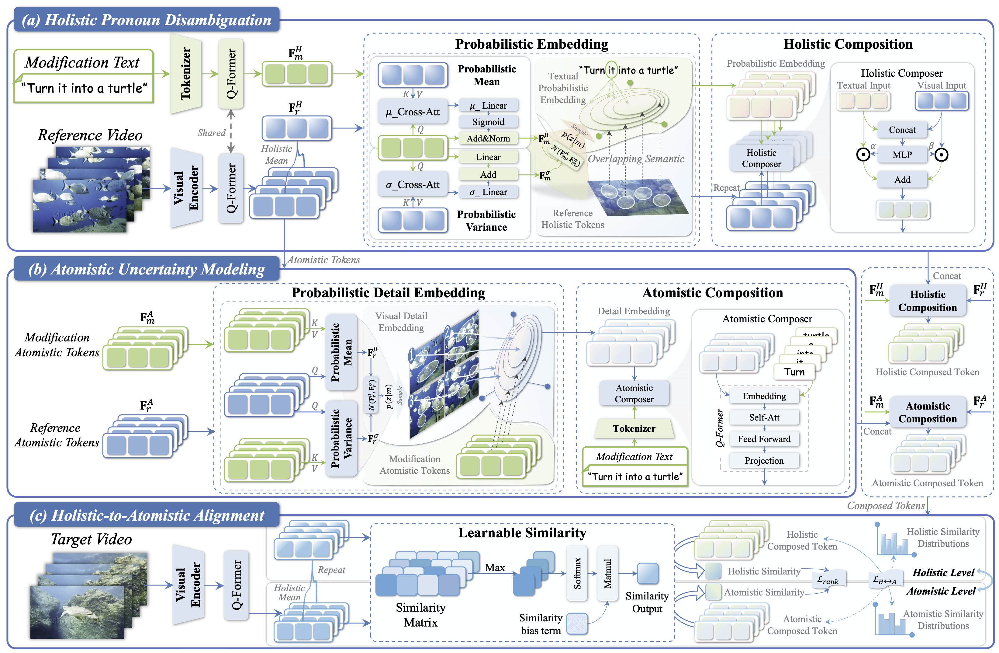
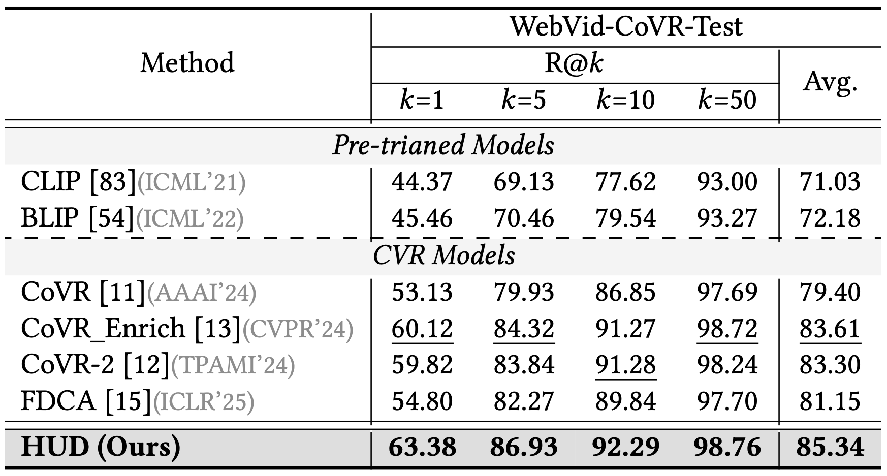
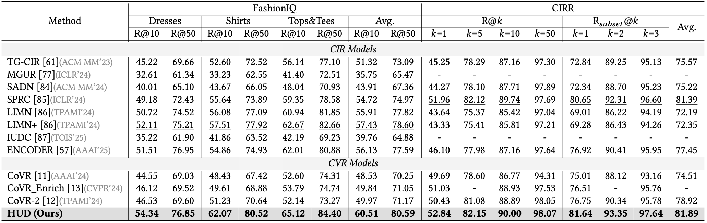

<a id="top"></a>
<div align="center">
  
  <h1>📹 (ACM MM 2025) HUD: Hierarchical Uncertainty-Aware Disambiguation Network for Composed Video Retrieval</h1>
  
  <p>
    <a href="https://acmmm2025.org/"></a>
    <a href="https://arxiv.org/abs/2512.02792"></a>
    <a href="https://doi.org/10.1145/3746027.3755445"></a>
    <a href="https://zivchen-ty.github.io/HUD.github.io/"></a>
        <a href="https://zivchen-ty.github.io"></a>
    <a href="https://pytorch.org/get-started/locally/"></a>
    
    <a href="https://github.com/"></a>
  </p>

  <p>
    <b>Accepted by ACM MM 2025:</b> A novel framework tackling both the 🎬 <b>Composed Video Retrieval (CVR)</b> and 🌁 <b>Composed Image Retrieval (CIR)</b> tasks by <i>leveraging the disparity in information density between modalities</i>.
  </p>
</div>


## 📖 Introduction

**HUD** is an advanced open-source PyTorch framework designed to improve multi-modal query understanding. It is the first framework that explicitly leverages the disparity in information density between video and text to address modification subject referring ambiguity and limited detailed semantic focus. It achieves state-of-the-art (SOTA) performance across both **Composed Video Retrieval (CVR)** and **Composed Image Retrieval (CIR)** benchmarks. 

[⬆ Back to top](#top)

## 📢 News
- **[2026-03-19]** 🚀 We migrate the all training and evaluation codes of HUD from Google Drive to a GitHub repository. 
- **[2025-07-05]** 🔥 Our paper *"HUD: Hierarchical Uncertainty-Aware Disambiguation Network for Composed Video Retrieval"* has been accepted by **ACM MM 2025**!

[⬆ Back to top](#top)

## ✨ Key Features

- 🎯 **Holistic Pronoun Disambiguation**: Exploits overlapping semantics through holistic cross-modal interaction to indirectly disambiguate the referents of pronouns in the modification text.
- 🔍 **Atomistic Uncertainty Modeling**: Leverages cross-modal interactions at the atomistic perspective to discern key detail semantics via uncertainty modeling, enhancing the model's focus on fine-grained visual details.
- ⚖️ **Holistic-to-Atomistic Alignment**: Adaptively aligns the composed query representation with the target video/image by incorporating a learnable similarity bias between the holistic and atomistic levels.
- 🧩 **Unified Framework**: Seamlessly supports both video (CVR) and image (CIR) retrieval tasks with strong generalization capabilities.

[⬆ Back to top](#top)


## 🏗️ Architecture

<p align="center">
  
  <figcaption><strong>Figure 1.</strong> The overall framework of HUD consists of three key modules: (a) Holistic Pronoun Disambiguation, (b) Atomistic Uncertainty Modeling, and (c) Holistic-to-Atomistic Alignment. </figcaption>
</p>

[⬆ Back to top](#top)

## 🏃‍♂️ Experiment-Results

### CVR Task Performance

<caption><strong>Table 1.</strong> Performance comparison on the test set of the CVR dataset, WebVid-CoVR, relative to R@k(%). The overall best results are in bold, while the best results over baselines are underlined.</caption>




### CIR Task Performance
<caption><strong>Table 2.</strong> Performance comparison on the CIR datasets, FashionIQ and CIRR, relative to R@k(%). The overall best results are in bold, while the best results over baselines are underlined.</caption>



[⬆ Back to top](#top)

## Table of Contents

- [Introduction](#-introduction)
- [News](#-news)
- [Key Features](#-key-features)
- [Architecture](#️-architecture)
- [Experiment Results](#️-experiment-results)
- [Quick Start & Installation](#-quick-start--installation)
- [Repository Structure](#-repository-structure)
- [Configuration Overview](#️-configuration-overview)
- [Data Preparation](#️-data-preparation)
- [Training](#️-training)
- [Evaluation/Testing](#-evaluation--testing)
- [Output & Checkpoints](#-output--checkpoints)
- [Acknowledgement](#-acknowledgements)
- [Contact](#️-contact)
- [Citation](#️-citation)
- [Support & Contributing](#-support--contributing)


## 🚀 Quick Start & Installation

We recommend using Anaconda to manage your environment following **[CoVR-Project](https://github.com/lucas-ventura/CoVR)**. *Note: This project was developed and tested with **Python 3.8.10**, **PyTorch 2.1.0**, and an **NVIDIA A40 48G** GPU.*

```bash
# 1. Clone the repository
git clone https://github.com/ZivChen-Ty/HUD
cd HUD

# 2. Create a virtual environment
conda create -n hud python=3.8.10 -y
conda activate hud

# 3. Install PyTorch (Adjust CUDA version based on your hardware)
conda install pytorch==2.1.0 torchvision torchaudio pytorch-cuda=11.8 -c pytorch -c nvidia

# 4. Install other dependencies
pip install -r requirements.txt
```

[⬆ Back to top](#top)

## 📂 Repository Structure

Our codebase is highly modular. Here is a brief overview of the core files and directories:

```text
HUD/
├── configs/               # ⚙️ Hydra configuration files (data, model, trainer, etc.)
├── src/                   # 🧠 Source code (dataloaders, model implementations, testing)
├── train_CVR.py           # 🎥 Training entry point for WebVid-CoVR
├── train_CIR.py           # 🌃 Training entry point for FashionIQ & CIRR
├── test.py                # 🧪 Evaluation entry point
└── requirements.txt       # 📦 Project dependencies
```

[⬆ Back to top](#top)

## ⚙️ Configuration Overview

All hyperparameters and paths are managed by **Hydra** under the `configs/` directory. The key configuration groups are:

  - `configs/data/` — Dataset loaders and dataset-specific path definitions.
  - `configs/model/` — Model architecture, checkpoints, optimizers, schedulers, and loss functions.
  - `configs/trainer/` — Lightning Fabric training settings (devices, precision, checkpointing).
  - `configs/machine/` — Hardware/Machine settings (batch size, num workers, default root paths).
  - `configs/test/` — Evaluation presets across different test splits.

[⬆ Back to top](#top)

## 🗃️ Data Preparation

By default, the datasets are expected to be placed under a common root directory.

> 💡 **Path Configuration:** You must adjust these paths for your local setup. There are two recommended ways to do this:</br>
>
> 1.  **Edit YAML directly (Preferred):** Modify `configs/machine/default.yaml` or the specific files in `configs/data/*.yaml`.</br>
> 2.  **Override via CLI:** Append `machine.default.datasets_dir=/path/to/data` to your run commands.

### 1\. Composed Video Retrieval (CVR)

**Dataset:** [WebVid-CoVR](https://github.com/lucas-ventura/CoVR.git)

Expected directory structure:

```text
datasets_dir/
└── WebVid-CoVR/
    ├── videos/
    │   ├── 2M/
    │   └── 8M/
    └── annotation/
        ├── webvid2m-covr_train.csv
        ├── webvid8m-covr_val.csv
        └── webvid8m-covr_test.csv
```

### 2\. Composed Image Retrieval (CIR)

**Datasets:** [FashionIQ](https://github.com/XiaoxiaoGuo/fashion-iq) and [CIRR](https://github.com/Cuberick-Orion/CIRR)

Expected directory structure:

```text
datasets_dir/
├── FashionIQ/
│   ├── captions/
│   │   ├── cap.dress.[train|val|test].json
│   │   └── ...
│   ├── image_splits/
│   │   ├── split.dress.[train|val|test].json
│   │   └── ...
│   ├── dress/
│   ├── shirt/
│   └── toptee/
└── CIRR/
    ├── train/
    ├── dev/
    ├── test1/
    └── cirr/
        ├── captions/
        │   └── cap.rc2.[train|val|test1].json
        └── image_splits/
            └── split.rc2.[train|val|test1].json
```

[⬆ Back to top](#top)

## 🧨 Training

You can easily override hyperparameters, datasets, and paths directly from the command line using Hydra syntax.

### Train CVR Model (WebVid-CoVR)
```bash
python train_CVR.py
```

### Train CIR Model (FashionIQ or CIRR)
```bash
python train_CIR.py
```

> ⚠️ Before running CIR training, make sure to update the dataset selection in `configs/train_CIR.yaml` (`data` and `test` in `defaults`) to your target dataset (e.g. `fashioniq` or `cirr`).
>
> For example:
> ```yaml
> defaults:
>   - data: fashioniq
>   - test: fashioniq
> ```
> or:
> ```yaml
> defaults:
>   - data: cirr
>   - test: cirr-all
> ```

[⬆ Back to top](#top)

## 🧪 Evaluation / Testing

To evaluate a trained model, use `test.py` and specify the target benchmark.

```bash
python3 test.py
```

*(Make sure to specify the dataset and path to your trained checkpoint via the config overrides or by updating the relevant `configs/test/*.yaml` file).*

[⬆ Back to top](#top)

## 📌 Output & Checkpoints

Hydra automatically manages your experiment logs and weights.

  - Outputs are systematically written to: `outputs/<dataset>/<model>/<ckpt>/<experiment>/<run_name>/`.
  - Checkpoints are saved inside the run directory as `ckpt_last.ckpt` (or `ckpt_<epoch>.ckpt` if configured).

[⬆ Back to top](#top)

## 🤝 Acknowledgements

Our implementation is based on [CoVR-2](https://github.com/lucas-ventura/CoVR/tree/master) for the foundational Composed Video Retrieval baselines and datasets and [LAVIS](https://github.com/salesforce/LAVIS) for providing robust Vision-Language models like BLIP-2. We sincerely thank the authors for their great open-source projects.

[⬆ Back to top](#top)

## ✉️ Contact

For any questions, issues, or feedback, please reach out to me zivczw@gmail.com ☺️

[⬆ Back to top](#top)

## 📝⭐️ Citation

If you find our work or this code useful in your research, please consider leaving a **Star**⭐️ or **Citing**📝 our paper 🥰. Your support is our greatest motivation\!


```bibtex
@inproceedings{HUD, 
  title = {HUD: Hierarchical Uncertainty-Aware Disambiguation Network for Composed Video Retrieval}, 
  author = {Chen, Zhiwei and Hu, Yupeng and Li, Zixu and Fu, Zhiheng and Wen, Haokun and Guan, Weili}, 
  booktitle = {Proceedings of the ACM International Conference on Multimedia}, 
  pages = {6143–6152}, 
  year = {2025} 
}
```

[⬆ Back to top](#top)

## 🫡 Support & Contributing

We welcome all forms of contributions\! If you have any questions, ideas, or find a bug, please feel free to:

  - Open an [Issue](https://github.com/ZivChen-Ty/HUD/issues) for discussions or bug reports.
  - Submit a [Pull Request](https://github.com/ZivChen-Ty/HUD/pulls) to improve the codebase.

[⬆ Back to top](#top)

